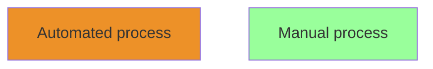
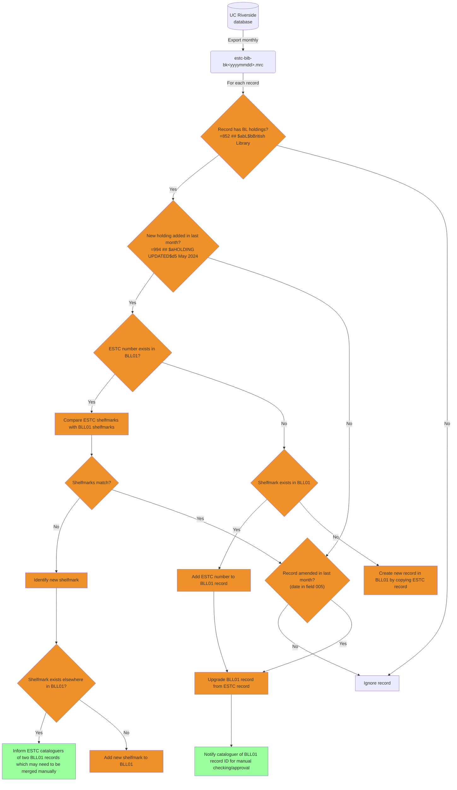

# ESTC migration

## Plan

```mermaid
graph TD;
n1[Automated process]
n2[Manual process]
classDef automated fill:#ed9128
classDef manual fill:#99ff9b
class n1 automated;
class n2 manual;
```

```mermaid
flowchart TD;
A[(UC Riverside<br/>database)] -->|Export monthly| B(estc-bib-bk&lt;yyyymmdd&gt;.mrc)
B -->|For each record|C{"Record has BL holdings?<br/>=852 ## $abL$bBritish Library" }
C -->|Yes|D{"New holding added in last month?<br/>=994 ## $aHOLDING UPDATED$d5 May 2024" }
C -->|No|E[Ignore record]
D -->|Yes|F{"ESTC number exists in BLL01?"}
D -->|No|G{"Record amended in last month?<br/>(date in field 005)"}
F -->|Yes|J["Compare ESTC shelfmarks with BLL01 shelfmarks"]
J -->L{Shelfmarks match?}
L -->|No|M[Identify new shelfmark]
L -->|Yes|G
M -->N{Shelfmark exists elsewhere in BLL01?}
N -->|Yes|O[Inform ESTC cataloguers of two BLL01 records which may need to be merged manually]
N -->|No|P[Add new shelfmark to BLL01]
F -->|No|I{"Shelfmark exists in BLL01"}
I -->|Yes|Q[Add ESTC number to BLL01 record]
I -->|No|R[Create new record in BLL01 by copying ESTC record]
G -->|No|E
Q -->S[Upgrade BLL01 record from ESTC record]
S -->T[Notify cataloguer of BLL01 record ID for manual checking/approval]
G -->|Yes|S
classDef automated fill:#ed9128
classDef manual fill:#99ff9b
class C,D,F,G,I,J,L,M,N,P,Q,R,S automated;
class O,T manual;
```
